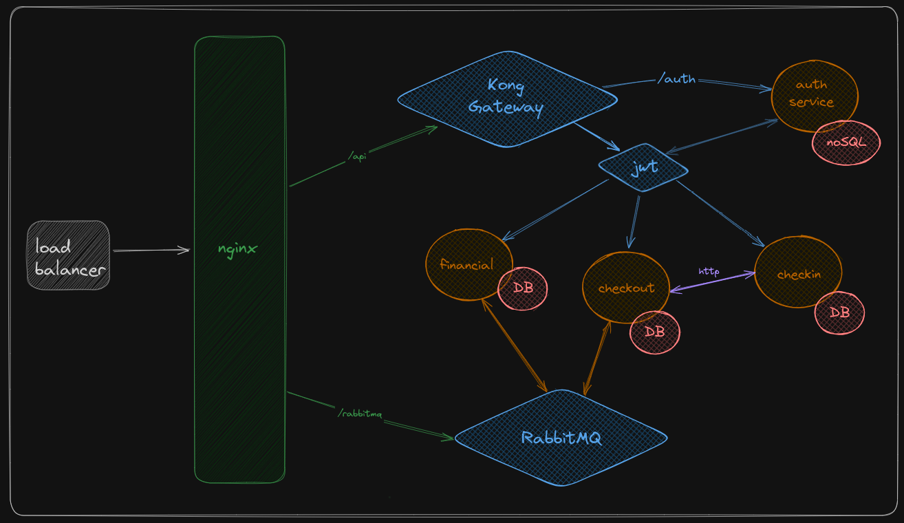

<h1 align="center">Orderly API Gateway</h1>

  <a href="#-project">Project</a>&nbsp;&nbsp;&nbsp;|&nbsp;&nbsp;&nbsp;
   <a href="#-project">Links</a>&nbsp;&nbsp;&nbsp;|&nbsp;&nbsp;&nbsp;
  <a href="#-technologies">Tecnologies</a>&nbsp;&nbsp;&nbsp;|&nbsp;&nbsp;&nbsp;
  <a href="#-running">Running</a>&nbsp;&nbsp;&nbsp;|&nbsp;&nbsp;&nbsp;
  <a href="#-license">License</a>

  

## 💻 Project

Orderly is a cutting-edge web system designed to streamline operations for restaurant and food businesses (RMS). It draws from the principles of **Domain-Driven Design (DDD)** and **Architectural Concepts** to ensure scalability, maintainability, and a robust integration capability.

## ✨ Technologies

This project was built using the following technologies and architectural concepts:

- [Kong API Gateway](https://konghq.com/)
- [NGINX](https://www.nginx.com/)
- [Docker](https://www.docker.com/)
- [PostgreSQL](https://www.postgresql.org/)
- [Redis](https://redis.io/)
- [Kubernetes](<https://kubernetes.io/>)

  <h2>Architecture</h2>
  

 